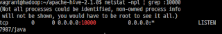
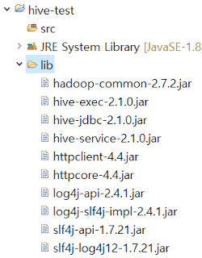
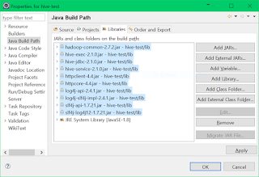
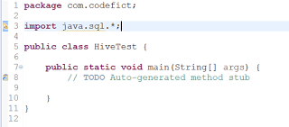
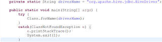
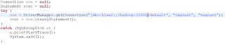
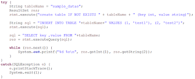
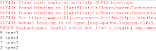
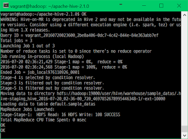
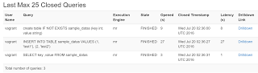

 Remote Hive 서비스와 연동하여 개발하기 위한 기본 설정과 연동을 살펴보고자 한다. 설치된 환경은 다음과 같다.

- Apache Hadoop 2.7.2
- Apache Hive 2.1.0

 둘 모두 사용자(vagrant) 홈에 설치되어 있다. 접속은 vagrant:vagrant로 하며, 호스트은 hadoop이다. Hive로 연동하기 위한 Hadoop의 설정은 다음과 같다.

\- core-site.xml
- hadoop.proxyuser.{username}.hosts = *
- hadoop.proxyuser.{username}.groups = *

접속할 때 사용할 사용자명을 {username}에 넣어주면 된다. 이는 접속해서 파일을 수정할 때 권한이 없는 문제를 해결하기 위한 설정이다. Hive는 따로 설정을 하지 않아도 된다.
설정을 완료하였으면, Hadoop과 Hive 서비스를 실행하고, 포트가 열렸는지 확인해준다.

포트가 열렸다면, 로컬 머신에서 이클립스를 실행하고 새로운 자바 프로젝트를 생성한다. 프로젝트에 라이브러리를 담을 폴더를 생성하고, 다음 경로에서 라이브러리 파일들을 폴더로 복사한다.

\- $HADOOP_HOME/share/hadoop/common
 - hadoop-common-*.jar

\- $HIVE_HOME/lib
 - hive-exec-*.jar
 - hive-jdbc-*.jar
 - hive-service-*.jar
 - httpclient-*.jar
 - httpcore-*.jar
 - log4j-api-*.jar
 - log4j-slf4j-impl-*.jar

\- SLF4J
 - slf4j-api-*.jar
 - slf4j-log4j12-*.jar

SLF4J는 라이브러리에 포함이 되어있지 않아 따로 다운로드 받아야한다.

복사가 완료되었다면, 프로젝트 라이브러리에 등록(Properties -> Java Build Path -> Libraries -> Add JARs...)해준다.

라이브러리 등록을 완료하면 main이 포함된 클래스를 생성하고, java.sql.*을 import해준다.

다음으로 JDBC에서 Hive 스키마를 읽기 위해 클래스를 로드한다.

Hive 2.x 버전에서는 hiveserver2로 기동하고, 따라서 스키마를 hive2로 지정해서 열어야 한다.

default DB에 vagrant:vagrant로 연결한다. 다음으로 테스트 쿼리를 실행해본다.

Hive에서는 기본키(PRIMARY KEY)를 지원하지않기 때문에 Column만 설정하고 생성한다. 'IF NOT EXISTS'를 지정하면 테이블이 없을 때만 생성한다.
'INSERT INTO TABLE'로 데이터를 삽입하는데, 'INSERT INTO'를 사용하면, 하나의 행만 삽입이 가능하다. 여기에 TABLE 키워드를 넣을 경우 MySQL과 같이 콤마(,)로 구분하여 다수의 행을 삽입할 수 있다.

이제 소스를 저장하고 실행하면, 테이블에 값을 삽입하고, SELECT로 불러옴을 알 수 있다. 기존에 테이블이 이미 생성되어 있어서 2개의 행을 더 출력한다.

서버에서는 다음과 같이 로그가 갱신되는 것을 볼 수 있다.

Hive의 웹 인터페이스에서 쿼리 로그를 확인할 수 있다.

사용된 소스코드는 아래와 같다


package com.codefict;

import java.sql.*;

public class HiveTest {
 private static String driverName = "org.apache.hive.jdbc.HiveDriver";

 public static void main(String[] args) {
  try {
   Class.forName(driverName);
  }
  catch(ClassNotFoundException e) {
   e.printStackTrace();
   System.exit(1);
  }

  Connection con = null;
  Statement stmt = null;
  try {
   con = DriverManager.getConnection("jdbc:hive2://hadoop:10000/default", "vagrant", "vagrant");
   stmt = con.createStatement();
  }
  catch (SQLException e) {
   e.printStackTrace();
   System.exit(1);
  }

  try {
   String tableName = "sample_datas";
      ResultSet res;
      stmt.execute("create table IF NOT EXISTS " + tableName + " (key int, value string)");

      String sql = "INSERT INTO TABLE "+tableName+" VALUES (1, 'test1'), (2, 'test2')";
      stmt.execute(sql);

      sql = "SELECT key ,value FROM "+tableName;
      res = stmt.executeQuery(sql);

      while (res.next()) {
       System.out.printf("%d %s\n", res.getInt(1), res.getString(2));
      }
  }
  catch(SQLException e) {
   e.printStackTrace();
   System.exit(1);
  }
 }
}
