 최근 Tomcat 프로젝트를 하며, Jenkins를 이용한 auto-deployment를 해봤습니다. 이 경험을 바탕으로 Jenkins에 GitHub Hook를 적용하는 방법을 적어보고자 합니다.

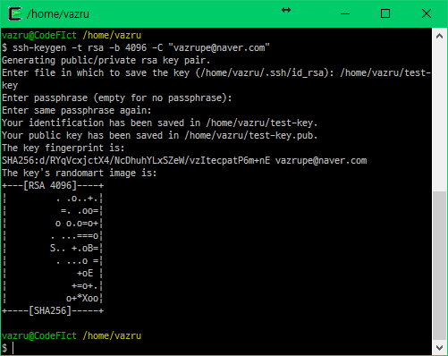 

 먼저 Jenkins Job에서 사용할 ssh키를 생성합니다. ([Generating a new SSH key and adding it to the ssh-agent](https://help.github.com/articles/generating-a-new-ssh-key-and-adding-it-to-the-ssh-agent/)) 생성할 때 passphrase를 묻는데 ssh키에 패스워드를 거는 겁니다. 필요하다 생각된다면, 적어도 무방합니다.
 생성이 완료되면 pub가 붙은 파일과 아닌 파일이 있습니다. pub가 붙은 파일을 GtiHub에 등록하고 아닌 파일을 Jenkins에 등록하게 됩니다.

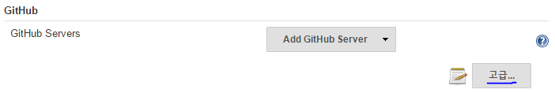

 이제 Jenkins로 가서 Git과 GitHub 플러그인을 설치해줍니다. 설치가 완료되면 Jenkins 관리 → 시스템 설정에 들어가서 GitHub 메뉴로 가서 고급 버튼을 눌러줍니다.

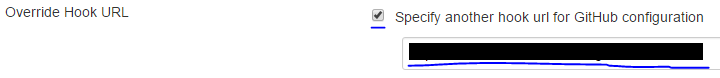

 버튼을 누르면 Override Hook URL 체크박스가 나오는데 이를 체크해주고 뒤에 있는 경로를 기억해두고나 복사해둡니다. 이 경로는 GitHub 서비스 등록에 사용됩니다.

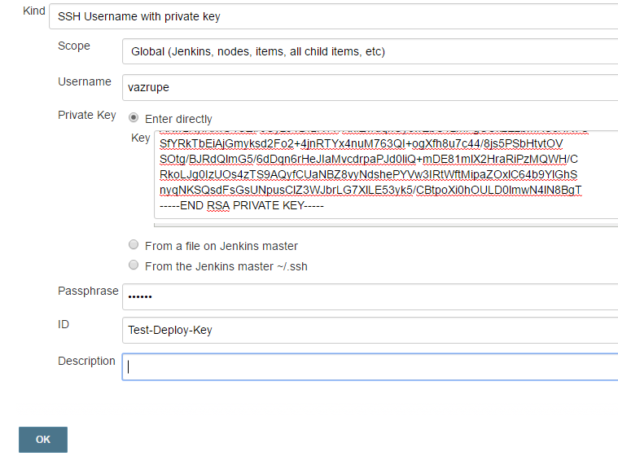

 다음으로 Credentials에 가서 SSH Username with private key로 바꾸고 Enter directly를 체크해줍니다. 따로 저장해 두었다면 다른 2개로 적용해도 상관없습니다.
 Username에는 구분하기 쉬운 이름을 넣어주면 됩니다. 해당 프로젝트 저장소 이름을 넣어서 구별하기 쉽게할 수 있습니다. ID는 Jenkins에 저장될 ID로 공백이 없고 유일해야 합니다. 두 값 모두 영향을 주지 않습니다.
 ssh 키를 생성할 때 Passphrase를 입력했다면 저기에 입력하고 OK를 눌러 저장합니다.

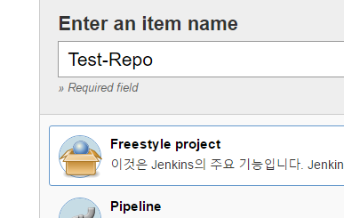

 이제 Job을 생성해줍니다. 적당한 이름을 넣고 원하는 걸로 지정해주면 됩니다.

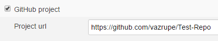

 GitHub project에 체크하고 저장소 경로를 입력해줍니다.

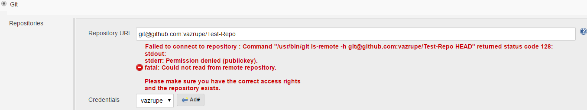

 소스 관리에는 Git을 체크하고 경로는 `git@github.com:닉네임/저장소이름`을 넣어줍니다. Credentials은 조금 전 저장한 SSH로 지정해줍니다

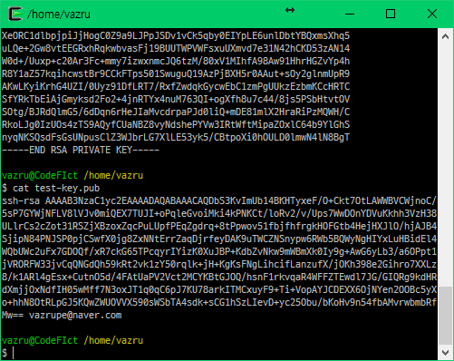
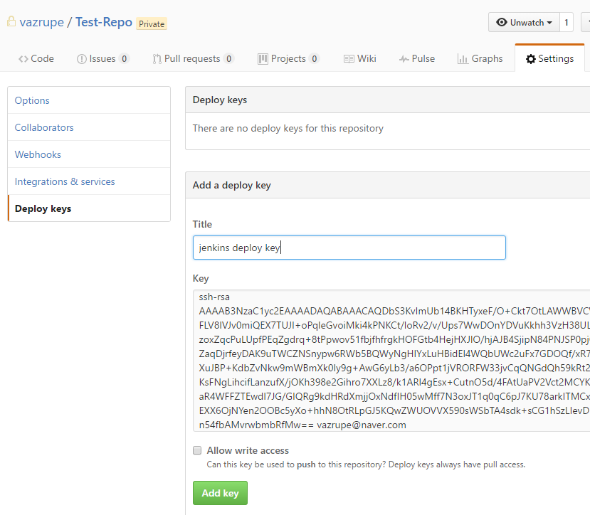
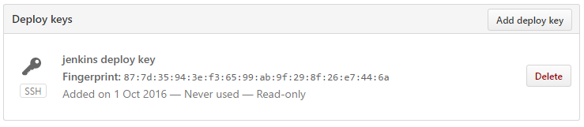

 이제 GitHub로 가서 SSH키를 등록해줍니다. 아까 생성한 키중 pub가 붙은 키를 저장소의 Deploy keys에 등록하면 됩니다.

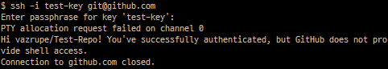

 키가 정상적으로 등록되었는지는 ssh -i private-key git@github.com를 입력하면 확인할 수 있습니다. 'Hi 저장소명'을 출력하여 정상적으로 출력되었다고 말해줍니다.

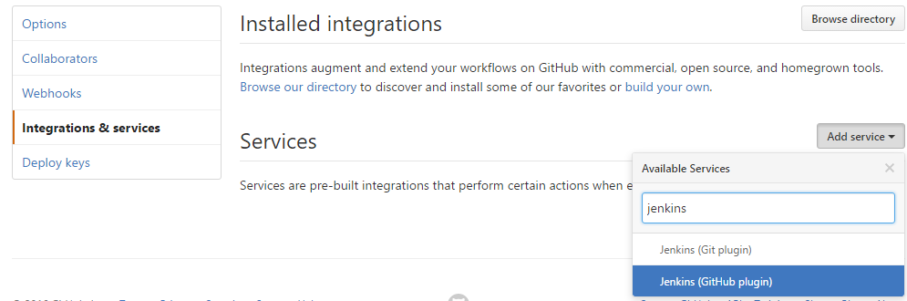

 이제 Hook 서비스를 등록합니다. Intergrations & services에서 Add service를 누르고 Jenkins (GitHub plugin)을 선택합니다.

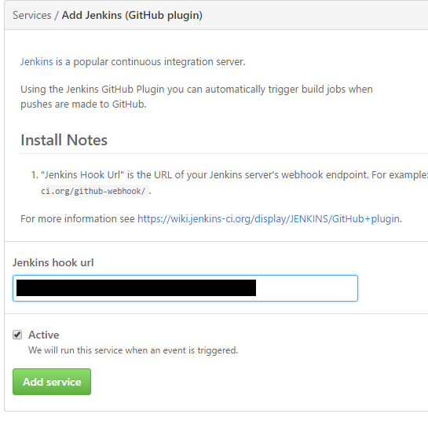

 Jenkins hook url에는 아까 설정한 Override Hook URL에 나오는 경로를 입력하고 저장해줍니다.

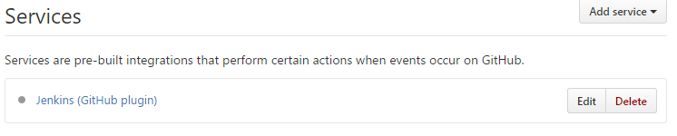

 다음과 같이 서비스가 등록된 것을 확인할 수 있습니다.

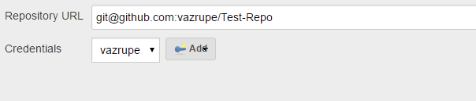

 다시 Job을 설정하러 갑니다. 아까 소스 관리에 등록한 키에서 나던 에러가 사라진 것을 확인할 수 있습니다.

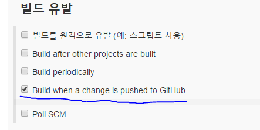

 빌드 유발에 Build when a change is pushed to GitHub를 체크합니다. GitHub에 푸쉬가 오면 동작하도록 하는 설정입니다.

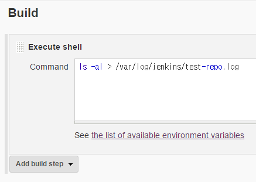
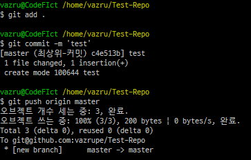

 빌드가 실행되는지 간단한 명령을 작성해서 테스트 해봅니다. 여기까지 작성이 완료되면 저장해줍니다.

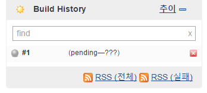

 적당히 저장소를 수정하고 push해주면 Build History에 pending되는 것을 확인할 수 있습니다. 무사히 종료되면 푸른색 아이콘으로 바뀌고, 실패하면 붉은색 아이콘으로 바뀝니다.

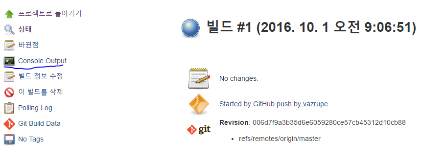

 작업이 진행되는 과정을 Console Output을 통해 확인할 수 있습니다.

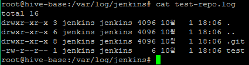

 로그를 확인해보면 지정된 명령이 잘 실행된 것을 확인할 수 있습니다.
 로그를 확인해보면 지정된 명령이 잘 실행된 것을 확인할 수 있습니다.