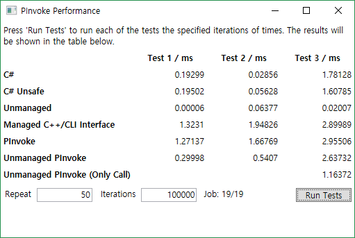
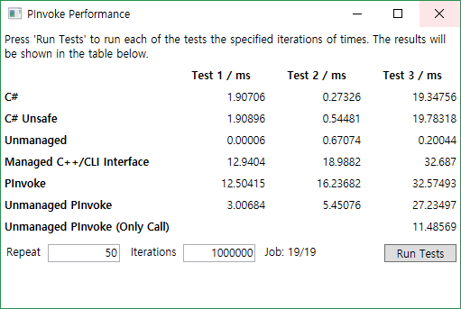
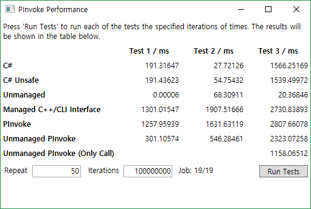
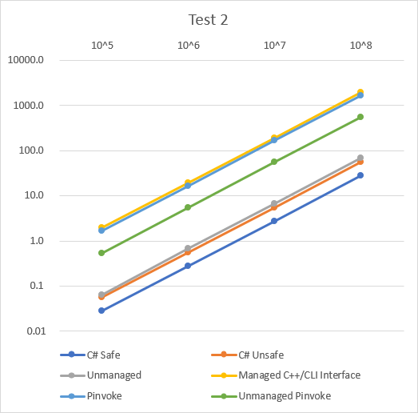
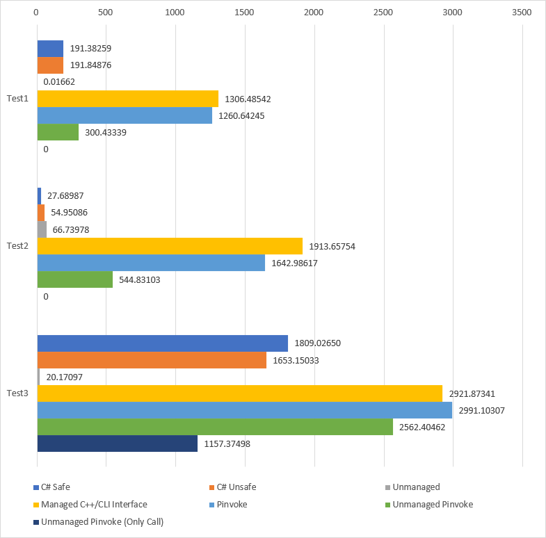
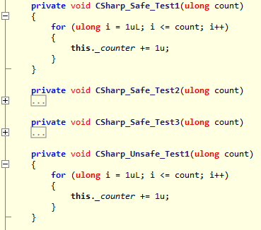
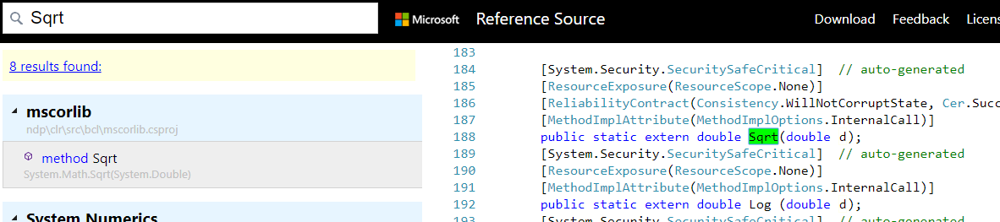
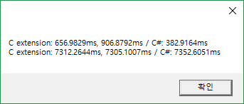
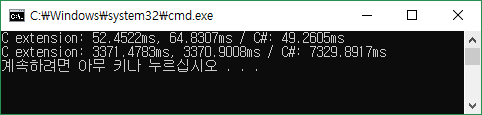

 평소에 개발할 때 Python, Go 혹은 C#을 사용하는 편인데, 셋 모두 일반적으로 C나 C++보다 느리다[^1].
 그래서 '만약 성능이 필요하다면 C로 짠 다음 가져다 쓰면 되겠지'라고 생각해왔고, 여태까지는 크게 성능 문제를 느낀 적은 없었다.

 요즘 C#만으로는 성능이 부족한 것을 느낄 때가 있는데, 그럴 때마다 'C#에서 P/Invoke로 C 함수를 사용하면 성능 향상이 얼마나 될까?' 하는 궁금증이 있었다.
 그래서 찾아보니 Code Project에 [C#에서 3가지 방법으로 C 함수를 사용했을 때의 성능을 테스트해둔 글](https://www.codeproject.com/Articles/253444/PInvoke-Performance)이 있었다.


 여기에는 3가지 방법으로 3종류의 C 함수에 접근해, 많이 실행시켰을 때의 결과가 있었다. 이 결과에서는 P/Invoke와 Managed Interface는 비슷하고, Unmanaged 코드는 둘과는 비교도 안 되게 빨랐다.

 다만 이 결과는 C#에서 C 함수를 호출하는 방법에 따른 성능을 비교한 것이었고, 내가 궁금했던 점과 달라 코드를 수정해 원하는 케이스에 대해 테스트해 봤다. 수정된 솔루션은 [GitHub](https://github.com/vazrupe/PInvokePerformance/tree/v181014)에서 확인할 수 있다.

# 변경 사항
## 프로젝트 설정

 x86(Win32) 타겟이었는데, 특정 케이스에서 실행 도중 메모리가 부족해 죽는 문제가 있어 모든 프로젝트를 x64로 수정했다.

### C++ 프로젝트

 최적화 옵션을 수정했다. 두 프로젝트 모두 속도 위주의 옵션으로 바꿨다.


## 기존 함수

기존 함수는 총 3개로 각각을 비교하면 아래와 같다.

| 함수 | 기능 | 연산 난이도 | 입력 -> 반환 |
| :--: | --- | :--: | --- |
| Test1 | 내부 변수(uint) 증감 | 쉬움 | void -> void |
| Test2 | 제곱근 계산 | 어려움 | double -> double |
| Test3 | 크기 3 배열 Product | 보통 | double[], double[] -> double |

 이 함수로도 내가 궁금했던 부분은 충분히 테스트 가능할 것 같아 그대로 사용하였다.

### C# 프로젝트

 코드가 너무 길어져 ViewModel 코드를 좀 더 짧게 바꿀 수 있도록 .Net 버전을 바꿨다. 그리고 안전하지 않은 코드(unsafe)를 실행할 수 있도록 설정했다.

## Test Case

 일단 모든 코드는 입력된 Iterations만큼 반복해 함수를 호출하고, 총 실행시간을 출력하게 되어 있다.
 `(iter)`는 iterator 코드가 있는 위치다. 라이브러리는 대괄호로 표시했다.

 그리고 정확한 측정을 위해 설정한 횟수만큼 반복 실행한 뒤 평균 시간을 반환하도록 했다.

### C# Safe

 기존 Test C 코드와 같은 구조로 작성된 함수다.

```
C# => C# Function (iter)
```

### C# Unsafe

 C# Safe와 같지만, unsafe block으로 코드를 감싸서 실행했다.

```
C# => C# Function (iter, unsafe)
```

### (기존) Unmanaged

 C 내부에서 Test 함수를 호출한다. 그리고 그 함수를 C#에서 P/Invoke로 호출한다.

```
C# =(P/Invoke)=> [ C Function (iter) => Test C Function ](Unmanaged Dll)
```

### (기존) Managed C++/CLI Interface

 .Net C++에 호출 인터페이스를 두고 C#에서 직접 사용하는 방식이다. 사용하기는 P/Invoke보다 편해 보인다.

```
C# (iter) => [ C++ Interface ](Managed Dll) => [ Test C Function ](Unmanaged Dll)
```

### (기존) P/Invoke

 C#에서 P/Invoke로 C 함수를 직접 호출하는 방식이다.

```
C# (iter) =(P/Invoke)=> [ Test C Function ](Unmanaged Dll)
```

### Unmanaged P/Invoke

 위와 같이 P/Invoke를 사용했지만, [SuppressUnmanagedCodeSecurityAttribute](https://docs.microsoft.com/en-us/dotnet/api/system.security.suppressunmanagedcodesecurityattribute?view=netframework-4.7.2)를 추가했다. 이 Attribute를 사용하면 Managed 코드에서 Unmanaged 코드를 실행할 때 행해지는 [보안 검사를 하지 않게 된다](https://stackoverflow.com/a/5600850). 따라서, 보안은 비교적 나빠지지만[^2], 성능을 높여 주게 된다.

```
C# (iter) =(P/Invoke, Unmanaged)=> [ Test C Function ](Unmanaged Dll)
```

 그리고 3번째 Test 함수만 데이터를 모두 만들어 둔 뒤, 실행만 하는 케이스(OnlyCall)를 추가했다.

## 코드 수정
### C++

 Unmanaged 함수의 경우 최적화가 되기 쉬운 구조로 되어 있기 때문에 Test 2와 3을 수정했다.
 Test 1은 단순한 증감 연산이기 때문에 구조를 변경하기 어려워 그대로 뒀다.


double test2Temp = 0.0;
TRADITIONALAPI_API void __stdcall TA_Test2(unsigned __int64 nTestCount)
{
	for(unsigned __int64 i = 1; i <= nTestCount; i++)
		test2Temp = TA_CalculateSquareRoot((double)i);
}

double test3Temp = 0.0;
TRADITIONALAPI_API void __stdcall TA_Test3(unsigned __int64 nTestCount)
{
	for(unsigned __int64 i = 1; i <= nTestCount; i++)
	{
		double arThreeTuple1[3] = {(double)i + 0.1, (double)i + 0.2, (double)i + 0.3 };
		double arThreeTuple2[3] = {(double)i - 0.7, (double)i - 0.6, (double)i - 0.5 };
		test3Temp = TA_DotProduct(arThreeTuple1, arThreeTuple2);
	}
}

TRADITIONALAPI_API double __stdcall Dummy()
{
	return g_uCounter + test2Temp + test3Temp;;
}


 Test 2와 3에 전역 변수에 반환 값을 넣고, 더미 함수를 추가했다.
 그리고 Test 3에 2개의 double 배열이 정수로 최적화될 수 있어, 특정 값을 더하고 빼서 배열을 생성하도록 수정했다.

 위 코드로 생성된 바이너리를 [Snowman](https://derevenets.com/)으로 디컴파일한 코드는 [Gist](https://gist.github.com/vazrupe/3e4fd3218813e0d968a6b2163fb58f7c)에서 확인할 수 있다.

### C\#

 다음이 수정되었다:

- 추가된 Test Case에 따른 코드를 추가했다.
- Test 실행 구조 변경. 테스트당 1개의 함수를 만들었다.
- 각각 테스트가 끝나면 바로 UI에 갱신되도록 수정했다.

### 번외 테스트

 위에서 수정하고 추가한 Test Case와는 별개로 `많은 데이터로 적은 연산을 하는 함수`와 `작은 데이터로 많은 연산을 하는 함수`를 추가했다. 이 함수의 실행 결과는 실행 결과를 설명하며 같이 설명할 예정이다.

 함수의 코드는 아래와 같다. `Unman`이 붙은 함수는 위 Test Case 중 `Unmanaged`를 흉내 낸 함수다.


TRADITIONALAPI_API double __stdcall ComplexCpp(double arr1[], double arr2[], __int32 length)
{
	double r = 0.0;
	for (int i = 0; i < length; i++)
	{
		r = r + arr1[i] * arr2[i];
		r = r - arr1[i] * arr2[length - i - 1];
		r = ::sqrt(r);
	}
	return r;
}

TRADITIONALAPI_API double __stdcall ComplexCpp2(__int32 num)
{
	double n = num;

	while (n > 1.0)
	{
		n = n / 1.00000001;
	}
	return n;
}

TRADITIONALAPI_API double __stdcall ComplexCppUnman(__int32 nTestCount)
{
	double * arr = new double[nTestCount];
	for (__int32 i = 0; i < nTestCount; i++)
	{
		arr[i] = i;
	}
	return ComplexCpp(arr, arr, nTestCount);
}

TRADITIONALAPI_API double __stdcall ComplexCpp2Unman(__int32 num)
{
	return ComplexCpp2(num);
}


 C# 코드는 아래와 같다. 위 두 함수를 P/Invoke로 호출했으며, 각각에 대응되는 C# 함수가 있다.


[DllImport("TraditionalAPI.dll")]
[SuppressUnmanagedCodeSecurity]
private static extern double ComplexCpp(double[] arr1, double[] arr2, int length);
[DllImport("TraditionalAPI.dll")]
[SuppressUnmanagedCodeSecurity]
private static extern double ComplexCpp2(int num);

[DllImport("TraditionalAPI.dll")]
[SuppressUnmanagedCodeSecurity]
private static extern double ComplexCppUnman(int length);
[DllImport("TraditionalAPI.dll")]
[SuppressUnmanagedCodeSecurity]
private static extern double ComplexCpp2Unman(int num);

public double ComplexCsharp(double[] arr1, double[] arr2, int length)
{
    double r = 0.0;
    for (int i = 0; i < length; i++)
    {
        r = r + arr1[i] * arr2[i];
        r = r - arr1[i] * arr2[length - i - 1];
        r = Math.Sqrt(r);
    }
    return r;
}

public double ComplexCsharp2(int num)
{
    double n = num;
    while (n > 1.0)
    {
        n = n / 1.00000001;
    }
    return n;
}


# 결과
## 실행 환경

- Processor: AMD Ryzen 7 1700 (overclocked 3.7GHz)
- Ram : 32G (DDR4-2666Mhz)
- OS : Windows 10 Home RS4 (x64)
- IDE : Visual Studio Community 2017 (15.7.3)

## 결과
**10^5 Iterations**


**10^6 Iterations**


**10^7 Iterations**


**10^8 Iterations**


### log-scale

 대부분은 일정하게 실행시간이 올라가는 것을 볼 수 있다.

**Test 1**

**Test 2**

**Test 3**


### Case별 성능

 Case 별 성능을 Test로 분류해 나타낸 그래프는 아래와 같다. 값은 평균 실행 시간이다.



 이 그래프를 통해 다음 순서로 성능이 좋음을 알 수 있다.

1. Unmanaged
2. C# Unsafe ≥ C# Safe
3. Unmanaged P/Invoke
4. P/Invoke ≥ Managed C++/CLI Interface(일정하지 않음)

# 결과 살펴보기
## 결과
 테스트 결과는 의외로 `Unmanaged`를 제외한 모든 경우에서 C# 함수가 더 빨리 실행된다.
 `Unmanaged`가 빠른 것은 컴파일러의 코드 최적화가 잘 돼서 그런 것으로 보인다.

 어찌 보면 `Unmanaged`는 내가 알고 싶은 내용과 관계으므로 딱히 살펴볼 필요가 없다.
 하지만 Test 1과 2에서 특이한 결과가 있으니, 이에 대해 살펴본 뒤 다른 결과를 보고자 한다.

### Unmanaged Case

 `Unmanaged` Case는 다른 결과와 다르게 C/C++ 컴파일러의 최적화를 많이 받았다.
 모든 Test는 Iterations만큼 각 함수를 실행했는데, 이를 반복하는 코드가 C/C++ 코드에 있었다.

#### Test 1
 먼저 Test 1은 log-scale 그래프에서 다른 값과 다르게 Iterations에 따른 변화가 없다.
 Test 1 함수는 단순히 정수를 증감시키는데, 이로 인해 반복 실행되는 부분과 함께 아래와 같이 최적화될 수 있다.


TRADITIONALAPI_API void __stdcall TA_Test1(unsigned __int64 nTestCount)
{
    g_uCounter += nTestCount;
}


 실제로 디컴파일된 코드는 아래와 같다.


void TA_Test1(uint64_t rcx) {
    int32_t tmp32_2;

    if (rcx >= 1) {
        tmp32_2 = g1800056e0 + *reinterpret_cast<int32_t*>(&rcx);
        g1800056e0 = tmp32_2;
    }
    return;
}


 하지만, 코드가 같은 `C# Safe/Unsafe` Case는 일정하게 실행 시간이 상승하는데, 최적화되지 않았기 때문이다.
 디컴파일해보면 코드가 같은 것을 볼 수 있다.



### Test 2

 Test 2의 경우 Test 1, 3와는 다르게 오히려 `C# Safe/Unsafe`보다 느리게 실행된다.
 그 이유는 C#의 `Math.Sqrt` 함수가 C 함수를 호출해 실행되기 때문이다.



 그래서 `C# Safe/Unsafe`와 `Unmanaged`에서의 호출 순서는 아래와 같다.

```
C# Safe/Unsafe Case:
C# => Math.Sqrt => C sqrt

Unmanaged Case:
C# =(P/Invoke)=> C extension => Test 1 Function => C sqrt
```

 즉, 호출 스택이 깊어지고, P/Invoke의 영향까지 받아 실행 시간이 오히려 느려지게 된다.

## C# 함수와 P/Invoke 호출 함수

 모든 결과에서 예상과는 달리 P/Invoke로 C 함수보다, 동일한 로직의 C# 함수를 호출하는 것이 성능이 좋았다.
 각 Case별 실행 시간은 다음 순서로 빠르다.

1. C# Safe/Unsafe
2. Unmanaged P/Invoke
3. Managed C++/CLI Interface, P/Invoke

 이에 대해서는 결과가 너무 명확해 설명이 필요하지 않다.

## 번외: 많은 양의 데이터과 작지만 연산이 많은 작업이라면?

 지금까지 테스트한 모든 케이스는 간단한 함수를 많이 호출해 성능을 측정했다.
 그래서 P/Invoke로 인한 성능 저하가 두드러지게 나타나게 되었다.
 그렇다면, 반대로 성능 저하를 최대한 줄이기 위해 한 번만 함수를 호출하고, 연산량이 많은 함수를 비교하면 어떻게 될까?
 이 궁금증을 풀기 위해 번외 테스트를 준비했다.

 하나는 매우 긴 `double[]`을 Product 하는 함수고, 다른 하나는 입력값을 1.00000001로 나눠 1보다 작아지면 반환하면 함수다.

 실행은 다음과 같이 했다.
 첫 번째 함수에서는 100,000,000개의 `double` 값을 입력으로 주고, 두 번째 함수에서는 1,000,000,000을 입력했다.
 이론상 실행 횟수는 `log(100,000,000)/log(1.00000001)`로 약 2,072,326,606회의 루프를 돌아야 함수가 종료된다.


### 실행 결과


 두 경우 모두 P/Invoke로 인한 성능 저하에 최대한 영향을 받지 않도록 하였음에도 C#이 더 빠르거나, 비슷한 결과를 보인다.

### 배열이 전부 복사되어 느린 게 아닐까?

 첫 번째 함수를 다음과 같이 수정하고, 기존과 같은 100,000,000개의 배열을 전달해보았다. 결과로 1이 반환되어야 한다.


TRADITIONALAPI_API double __stdcall ComplexCpp(double arr1[], double arr2[], __int32 length)
{
	return arr1[1] * arr2[1];
}



 실행 시간이 `1ms`로 배열 전체가 복사되는 게 아닌, 참조로 넘겨지는 것을 알 수 있다.

 이에 대해서는 [MSDN의 글](https://docs.microsoft.com/en-us/dotnet/framework/interop/blittable-and-non-blittable-types)에서 관련 정보를 알 수 있다. Blittable/Non-Blittable Type이 있는데, Blittable의 경우 입력과 출력에서 변환되지 않고 바로 넘겨진다.

 기본 자료형의 1차원 배열은 Blittable Type이기 때문에 참조로 값이 넘겨지게 된다.

> The following complex types are also blittable types:

> - One-dimensional arrays of blittable types, such as an array of integers. However, a type that contains a variable array of blittable types is not itself blittable.

### Visual C++이라 느린건 아닐까?

 위 결과가 혹시 Visual C++을 사용하기 때문에 느린 게 아닐까 하는 생각에 [MinGW](http://www.mingw.org/)의 g++ 컴파일러를 이용해서 테스트해봤다.

 x86으로 컴파일되었으며 이에 따라 첫 번째 함수에서 100,000,000개가 아닌 1,000,000개의 `double`을 입력으로 사용했다. g++ 컴파일 옵션으로 `-O3`, `-Ofast` 옵션을 주어 최적화했다. 결과는 아래와 같다.



 드디어 처음으로 C 외부 함수가 C# 함수보다 좋은 성능을 보여줬다. 첫 번째 함수도 C# 함수와 큰 차이가 없는 실행 속도를 보여준다.

# 결론

 위의 결과에서 C#으로 작성한 함수가 P/Invoke로 호출한 함수보다 높은 성능을 보여준다.
 이로써 C 함수로 성능을 높이는 것보다, C# 함수를 개선해 성능을 높이는 게 더 좋음을 알 수 있다.

 물론 `Unmanaged` Case와 번외 테스트의 경우 C/C++ 컴파일러로 최적화된 바이너리가 높을 성능을 낼 수 있음을 알려준다.
 단, 실제 적용할 때는 벤치마킹을 통해 성능이 좋은지 확인하고 써야 할 것이다.

 이제 결론을 내려보면 C#에서 P/Invoke를 사용해야 하는 경우는 아래의 두 경우로 정리할 수 있다.

1. 다양한 프로그래밍 언어에 사용할 수 있는 범용/코어 라이브러리를 만들고 이를 호출할 때
2. 최고 수준의 고성능 애플리케이션을 만들어야 하는 경우

# 주의점

 이 글의 모든 테스트 결과는 C# 함수와 __C#에서 호출한 C 함수__를 비교한 것이다.
 결코 C 함수가 느린게 아니다.

 오히려 `Unmanaged` Case나 번외 테스트를 보면 컴파일러에 의해 최적화된 C/C++ 코드가 엄청난 성능을 보여준다.

# Reference

- [PInvoke Performance - Code Project](https://www.codeproject.com/Articles/253444/PInvoke-Performance)
- [Is there generally a noticeable performance hit when calling PInvoke on Win32 / COM methods? - Stack Overflow](https://stackoverflow.com/questions/5592572/is-there-generally-a-noticeable-performance-hit-when-calling-pinvoke-on-win32)
- [C# 코딩: Unmanaged Code Convention](http://www.csharpstudy.com/Guide/Guide-naming-native.aspx)

# 참고할만한 링크

- C# vs C++/CLI vs PInvoke Performance – [Part I](https://www.xinterop.com/index.php/2013/05/01/ccli-vs-pinvoke-performance-part-one/), [Part II](https://www.xinterop.com/index.php/2013/05/01/ccli-vs-explicit-pinvoke-performance-part-ii/), [Part III](https://www.xinterop.com/index.php/2013/05/03/ccli-vs-pinvoke-performance-part-iii/)
- [P/Invoke Tips](http://benbowen.blog/post/pinvoke_tips/)

[^1]: C/C++ vs [Python](https://benchmarksgame-team.pages.debian.net/benchmarksgame/faster/python3-gcc.html), [Go](https://benchmarksgame-team.pages.debian.net/benchmarksgame/faster/go-gcc.html), [C#](https://benchmarksgame-team.pages.debian.net/benchmarksgame/faster/csharpcore-gpp.html)
[^2]: 정확히 어떤 보안 문제가 있는지는 검색을 해도 찾기 어려웠다. 그나마 이 [질문의 댓글](https://stackoverflow.com/q/6635326)에서 몇 가지 문제가 있을 수 있음을 알려주고 있다.