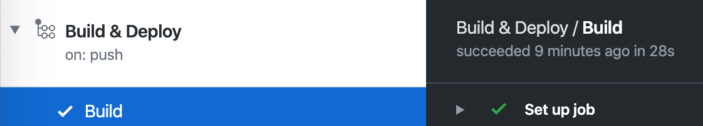
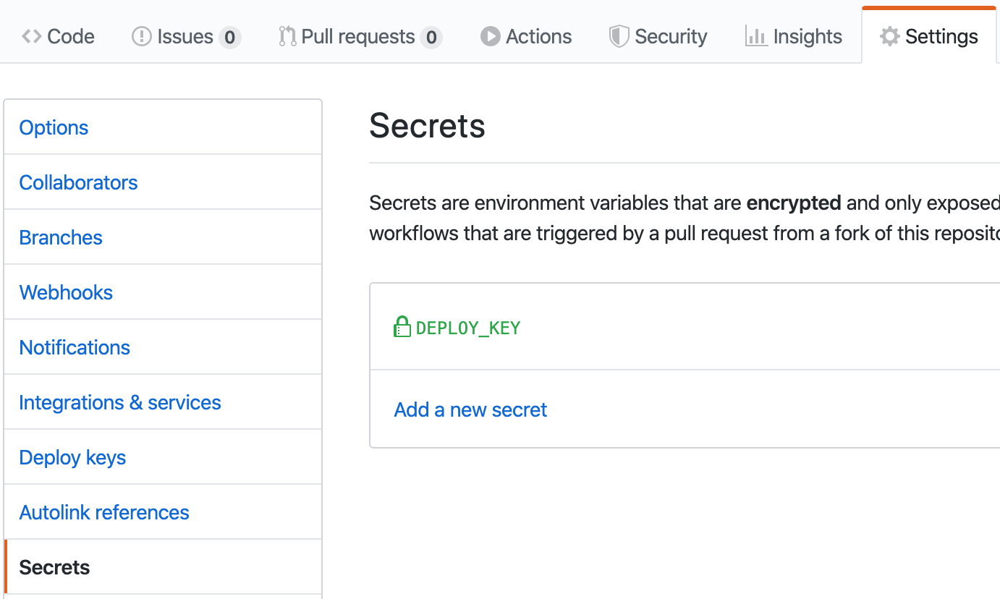
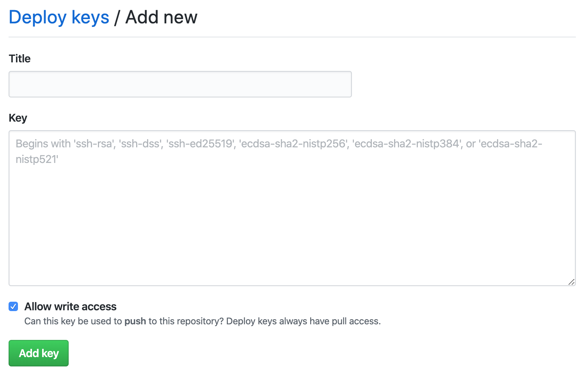
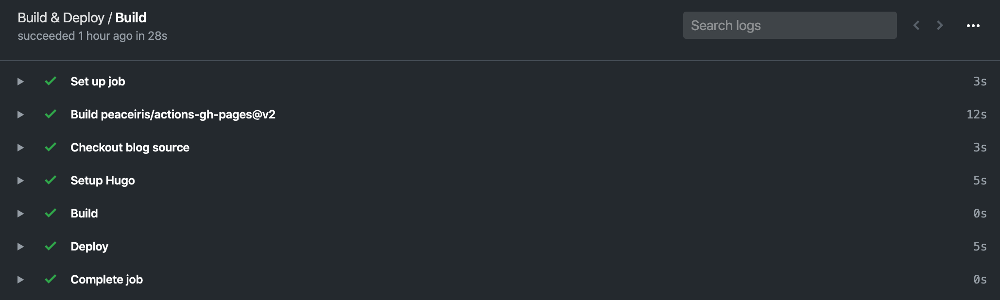
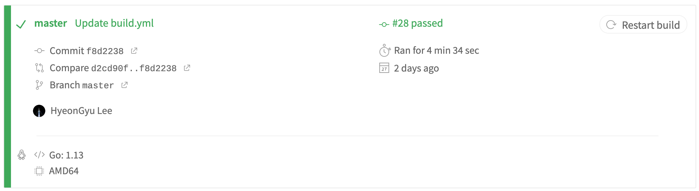

 최근 GitHub Actions를 써봤는데 생각보다 괜찮아서 블로그 배포 방식도 이걸로 바꾸기로 했다. 기존에는 [travis-ci](https://travis-ci.org/)를 [사용](https://github.com/vazrupe/blog/blob/ce55ce6ea2811d037a9fefb00b2a02f81349aa66/.travis.yml)했다. 아래와 같은 흐름으로 배포된다.

1. [vazrupe/blog](https://github.com/vazrupe/blog) master 브런치가 푸시된다.
2. `git checkout`한다. 테마를 submodule로 사용하기 때문에 `--recursive` 옵션을 설정해야 한다.
3. `go get`으로 `hugo`를 설치한다.
4. `hugo` 명령으로 블로그를 빌드한다.
5. [vazrupe/vazrupe.github.io](https://github.com/vazrupe/vazrupe.github.io)의 master 브런치에 public 디렉토리 내용을 업데이트 한다.

 위 방법은 `go get`으로 설치하기 때문에 hugo의 버전을 지정할 수 없었는데, 마침 특정 hugo 버전을 사용할 수 있게 해주는 [액션](https://github.com/peaceiris/actions-hugo)이 있었다.

 [워크플로우 설정](https://github.com/vazrupe/blog/blob/e5ca657f7d61a41d0327fd40b99013ab458ccf9c/.github/workflows/build.yml)의 각 부분은 다음과 같다.

```
name: Build & Deploy

on:
  push:
    branches:
      - master
```

 워크플로우의 이름과 언제 실행되는지를 나타낸다. master 브런치가 푸시될 때 이 워크플로우가 실행된다.

```
jobs:
  build:
    name: Build
    runs-on: ubuntu-latest
    steps:
```

 워크플로우의 작업을 정의한다. 1개의 작업만 있고 `build`를 키로, `Build`를 이름으로 하는 작업을 정의한다.
 ubuntu 최신 버전에서 실행되며, steps에 실제 작업이 나열된다.



 위에서 설정한 워크플로우와 잡이 Actions에서 표시되는 것을 확인할 수 있다.

 steps는 오브젝트 리스트로 되어 있다. [문법]((https://ko.wikipedia.org/wiki/YAML#%ED%95%B4%EC%8B%9C%EC%9D%98_%EB%A6%AC%EC%8A%A4%ED%8A%B8))에 맞게 작성하면 된다.

```
- name: Checkout blog source
  uses: actions/checkout@v1
  with:
    submodules: recursive
```

 [현재 저장소를 checkout 하는 명령](https://github.com/actions/checkout/tree/releases/v1)이다. `submodules: recursive` 옵션으로 theme를 가져올 수 있다.

```
- name: Setup Hugo
  uses: peaceiris/actions-hugo@v2
  with:
    hugo-version: "0.60.1"

- name: Build
  run: hugo --config=config.toml,google_analytics.toml
```

 컨테이너에 hugo를 가져와 소스를 빌드한다. 현재 최신인 [0.60.1](https://github.com/gohugoio/hugo/releases/tag/v0.60.1)를 사용한다.

```
- name: Deploy
  uses: peaceiris/actions-gh-pages@v2
  env:
    EXTERNAL_REPOSITORY: vazrupe/vazrupe.github.io
    ACTIONS_DEPLOY_KEY: ${{ secrets.DEPLOY_KEY }}
    PUBLISH_BRANCH: master
    PUBLISH_DIR: ./public
```

 빌드된 페이지를 배포한다. `public` 폴더를 `vazrupe/vazrupe.github.io`의 master 브런치에 배포한다.



 secrets는 `Settings > Secrets`에 추가할 수 있다. 키는 [GitHub에 SSH 키를 등록할 때와 같은 방식으로 생성](https://help.github.com/en/github/authenticating-to-github/generating-a-new-ssh-key-and-adding-it-to-the-ssh-agent)하면 된다.



 public 키는 배포할 저장소에 `Settings > Deploy Keys`에 쓰기 권한(Allow write access)을 주고 추가하면 된다. 여기에 사용된 액션 저장소로 가도 [같은 안내](https://github.com/peaceiris/actions-gh-pages/tree/v2.5.0#1-add-ssh-deploy-key)를 확인할 수 있다.



 실제 로그를 확인하면 28초 만에 빌드, 배포되었다.



 기존에 사용하던 travis-ci의 빌드 시간이다. 속도가 훨씬 빨라졌고, 기존에는 할 수 없던 hugo 버전 설정도 가능하다.